# AmazingFit Watchface Studio


Professional development environment for AmazingFit/Huami watch faces with live preview and hot reload.

## ✨ Features

- 🎨 **Visual Editor** - WYSIWYG interface for designing watch faces
- ⚡ **Hot Reload** - See changes in real-time on virtual watch
- 🔧 **Code Converter** - Convert standard JS to ZeppOS API
- 📱 **Device Simulation** - Multiple AmazingFit models support
- 💾 **Project Management** - Save, load, and export watch faces

## 🚀 Quick Start

```bash
# Clone the repository
git clone https://github.com/yourusername/amazingfit-watchface-studio.git

# Install dependencies
npm install

# Start development server
npm run dev
```

```mermaid
graph TB
    Browser[Браузер] --> HTML[HTML файл]
    HTML --> CSS[Стили]
    HTML --> JS[JavaScript файлы]
    
    JS --> Editor[editor.js]
    JS --> Simulator[simulator.js]
    JS --> Emulator[zeppos-emulator.js]
    
    Editor -- HTTP/WebSocket --> Server[server.js]
    Simulator --> Canvas[Canvas API]
    Emulator --> Canvas
    
    Server --> FileSystem[Файловая система]
    Server --> WebSocket[WebSocket соединения]
    
    Editor -- eval() --> UserCode[Код циферблата пользователя]
    UserCode --> Emulator
    Emulator --> Canvas
    
    Canvas --> VisualOutput[Визуальный вывод]
```

